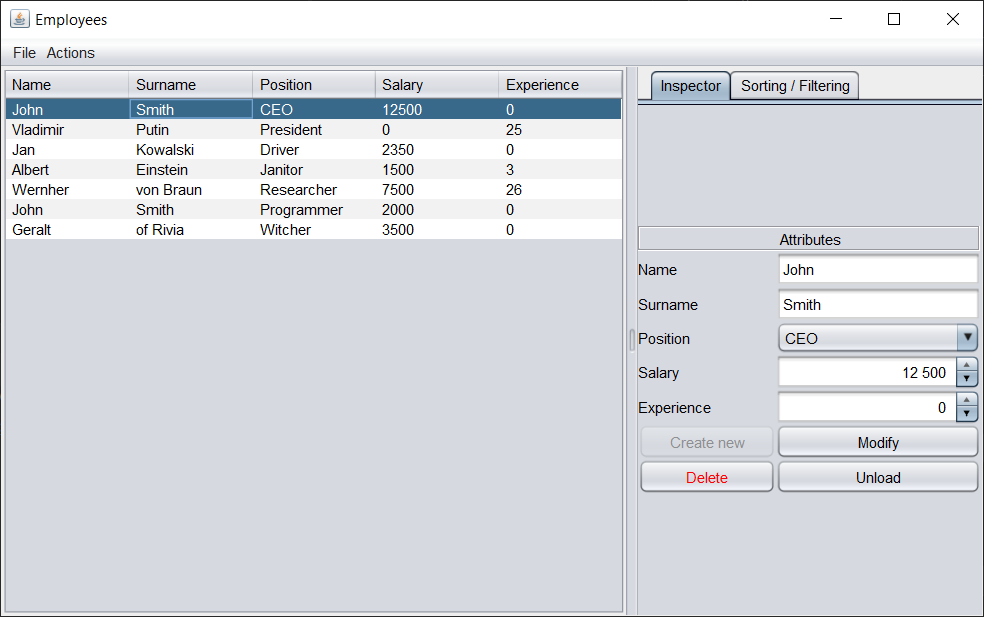
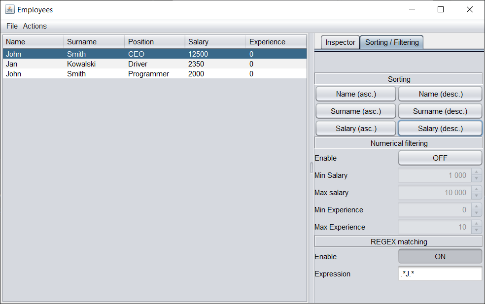

# Employees

## Description

A graphical editor for simple text-based databases about employees.

School project after the 2nd semester of university.

## Goals

Application...

* stores 5 features about employees (name, surname, position, salary and years of experience).
* uses Java Swing library to create Graphical User Interface.
* enables reading and writing information about employees to and from files.
* lets user to sort, edit and filter employees.
* checks if employee's salary matches the limits specific for a position. 

## Instructions

Application has 4 sections: a *bar* on a top, a *table* on the left, and an *inspector and sorting / filtering* section
on the right.

**Bar** allows doing basic file operations, i.e. saving and opening files.

**Table** helps to select specific employee, we want to edit.

**Inspector** allows modifying selected employee or adding a new one.

Remember to use *Modify* button to confirm input changes. To create a new record click *Create new*. Remember also that
you can create a new one only when you are done with modifying previous record. To do that *Unload* previous record.

**Sorting / Filtering** enables, as the name suggest, sorting and filtering.

Sorting can be done using one of the 3 features (alphabetically by a name, a surname or by salary), each one
in 2 version for both ascending and descending order.

Filtering of records can be executed with switchable 2 methods: numerically and by REGEX. Numerical can limit salary
or experience required to show the record.

Remember that filtering is only cosmetic. To see all records, turn off both filters.

## Implementation

One of the most important classes is `Employee`, which checks validity of each feature describing an employee.
It makes sure that name and surname do not have illegal characters and that salary matches employee's position.
It also enables serialization and deserialization.

Second important class is `EmployeeListLogic`. It stores all `Employees` in form of 2 lists: for unfiltered and
for filtered employees. It contains methods allowing changing filtering and sorting, but also serialization and
deserialization with writing and reading to and from files.

Rest of classes and interfaces in project are mainly to support `Employee` and `EmployeeListLogic` or provide
an interface for the user.